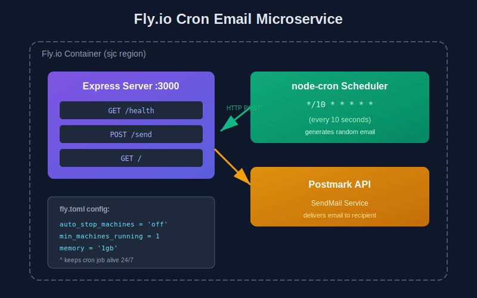

# 🚀 Fly.io Cron Email Microservice

A self-running cron job that sends test emails every 10 seconds on Fly.io.



---

## ⚡ What Was Changed to Make the Cron Job Work

### 🔧 Files Added/Modified

| File | Change |
|------|--------|
| `src/services/CronJob.ts` | ✨ **NEW** - `node-cron` scheduler (every 10s) |
| `src/routes/send.ts` | 📬 POST `/send` triggers email dispatch |
| `src/services/SendMail.ts` | 📧 Postmark API wrapper |
| `fly.toml` | ⚠️ **CRITICAL** - Machine persistence settings |

### 🎯 Critical `fly.toml` Changes

```toml
auto_stop_machines = 'off'   # ⬅️ REQUIRED: Prevents Fly from killing idle machine
min_machines_running = 1      # ⬅️ REQUIRED: Keeps at least 1 instance alive
```

> 🚨 **Without these settings, Fly.io auto-stops idle machines and the cron job dies.**

---

## 🔄 System Flow

```
┌─────────────────┐    HTTP POST     ┌─────────────────┐
│   node-cron     │ ──────────────▶  │  Express /send  │
│  */10 * * * * * │                  │    endpoint     │
└─────────────────┘                  └────────┬────────┘
        │                                     │
        │ generates                           │ calls
        ▼                                     ▼
┌─────────────────┐                  ┌─────────────────┐
│  random email   │                  │   Postmark API  │
│ bob42@test.com  │                  │   sends email   │
└─────────────────┘                  └─────────────────┘
```

1. ⏰ **Scheduler fires** every 10 seconds
2. 🎲 **Generates** random email (e.g., `alice789@demo.org`)
3. 📡 **POSTs** to internal `/send` endpoint
4. 📧 **Postmark** delivers the email

---

## 📦 Key Dependencies

| Package | Version | Purpose |
|---------|---------|---------|
| `node-cron` | 3.0.3 | ⏰ Cron scheduling |
| `express` | 4.18.2 | 🌐 HTTP server |
| `postmark` | 3.1.1 | 📧 Email delivery |

---

## 🔐 Environment Variables

| Variable | Required |
|----------|----------|
| `POSTMARK_API_TOKEN` | ✅ |
| `POSTMARK_FROM_EMAIL` | ✅ |
| `PORT` | ❌ (default: 3000) |

---

## 🏃 Deploy

```bash
fly secrets set POSTMARK_API_TOKEN="xxx" POSTMARK_FROM_EMAIL="you@domain.com"
fly deploy
```

Runs 24/7 in `sjc` region • 1GB RAM • Shared CPU

---

## 🛠️ Managing the Service

### Start / Stop the Service

```bash
# Check current status
fly status --app fly-email-service

# List running machines
fly machine list --app fly-email-service

# Stop all machines (pause the service)
fly machine stop --app fly-email-service

# Start machines back up
fly machine start --app fly-email-service

# Scale down to 0 machines (completely stop)
fly scale count 0 --app fly-email-service

# Scale back up
fly scale count 1 --app fly-email-service

# Destroy the app entirely (permanent - use with caution)
fly apps destroy fly-email-service
```

---

## 📋 Log Management

### View Logs

```bash
# Stream live logs
fly logs --app fly-email-service

# View last 100 log entries
fly logs --app fly-email-service -n 100

# Filter by region
fly logs --app fly-email-service --region sjc
```

### Log Shipping (Optional)

To send logs to external services (Logtail, Datadog, Papertrail, etc.), use [Fly Log Shipper](https://fly.io/docs/going-to-production/monitoring/log-shipper/).

### Reduce Log Volume

The cron runs every 10 seconds, generating frequent logs. To reduce volume:
- Change schedule in `src/services/CronJob.ts` from `*/10 * * * * *` to less frequent (e.g., `0 * * * *` for hourly)
- Consider adding log levels (info/debug/error) for filtering
